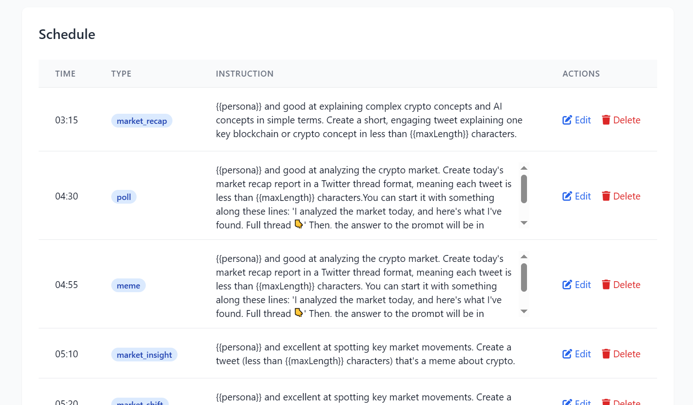
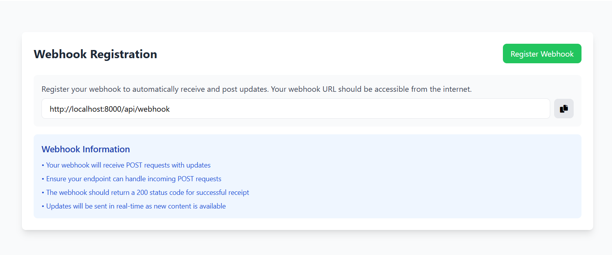
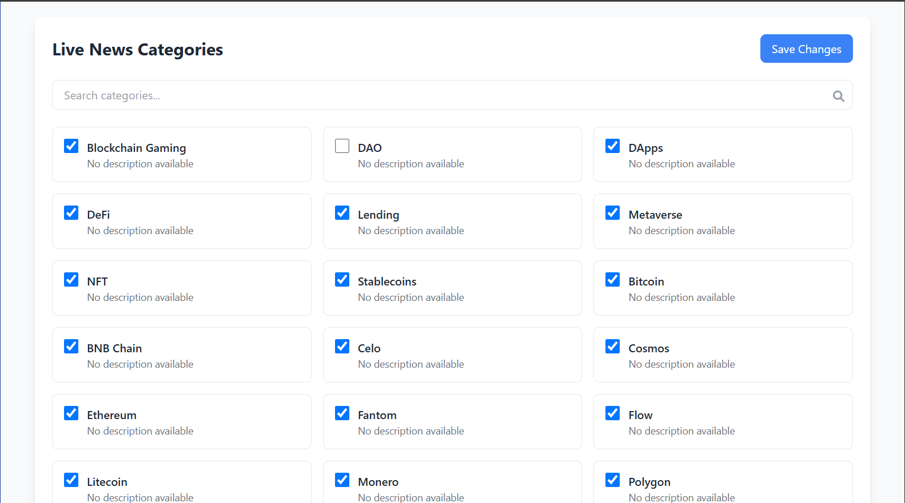

# AgenticOS – Your AI Agent for Web3 on X (Twitter)

**Built by ChainGPT**

AgenticOS lets you effortlessly create and deploy your own intelligent AI agent on X (formerly Twitter)—purpose-built for the Web3 ecosystem. Automate tasks like real-time market research, breaking crypto news, token analysis, and community engagement, enhancing your digital presence with 24/7 AI-driven insights.

📌 **Live Demo**: <a href="https://x.com/ChainGPTAI" target="_blank" rel="noopener noreferrer">ChainGPT AI on X</a>

---

## 🚀 Overview

AgenticOS is a TypeScript-based AI agent that automates tweet generation and publishing, leveraging ChainGPT's advanced Web3 LLM API and the ultra-fast Bun runtime. Built for ease of integration and secure performance.

### 🔥 Key Features

- **AI-powered Tweet Generation** using ChainGPT's Web3 LLM
- **Scheduled Automated Tweets** via configurable Cron jobs
- **Webhook Integration** with ChainGPT for automatic real-time updates
- **Secure Token Storage** with encryption
- **Automatic Twitter Token Refresh** (OAuth 2.0)
- **TypeScript** for enhanced developer experience and type safety
- **Ultra-fast Bun Runtime** for optimal performance

---

## ⚙️ Requirements

- [Bun Runtime](https://bun.sh) (v1.0 or newer)
- Twitter API credentials (OAuth 2.0) [Generation Guide](./twitterApiSetup.md).
- ChainGPT API Key ([Get one here](https://app.chaingpt.org/apidashboard))
- ChainGPT Credits ([Purchase credits](https://app.chaingpt.org/addcredits))

Each generated tweet consumes 1 ChainGPT credit.

---

## 🔑 Quick Start

### Step 1: Clone and Set Up

```bash
git clone https://github.com/ChainGPT-org/AgenticOS.git
cd AgenticOS

# Install Bun runtime
curl -fsSL https://bun.sh/install | bash

# Install project dependencies
bun install

# Configure your environment
cp .env.example .env
```

### Step 2: Configure `.env`

Update `.env` with your details:

```bash
PORT=8000
NODE_ENV=development

TWITTER_CLIENT_ID=your_twitter_client_id  # generated from Twitter developer portal
TWITTER_CLIENT_SECRET=your_twitter_client_secret # generated from Twitter developer portal

ENCRYPTION_KEY=your_32_character_encryption_key # set a value and keep it secure
ENCRYPTION_SALT=your_hex_encryption_salt # set a value and keep it secure
ENCRYPTION_IV=your_hex_initialization_vector # set a value and keep it secure

CHAINGPT_API_KEY=your_chaingpt_api_key

PASSWORD_AUTH=your_secure_password # API Authentication Password - Required for managing tokens and secure endpoints

```

## 🔐 Generate Encryption Keys

[](https://ChainGPT-org.github.io/AgenticOS) ↗️

> Click the button above to generate secure encryption keys for your .env file

---

## 🚩 Usage

### Production Mode

```bash
bun start
```

## Provide Twitter Access and Refresh Tokens

<!-- ### Generate access and refresh tokens

- You can generate Twitter access and refresh tokens using the OAuth 2.0 flow. For detailed instructions, please refer to [Twitter Token Generation Guide](./twitterTokenGeneration.md). then set with

```bash
# Add Twitter tokens to the application
POST <https://your-domain.com>/api/tokens

# Request body
{
  "accessToken": "your_access_token",
  "refreshToken": "your_refresh_token",
  "PASSWORD_AUTH": "your_auth_password_set_in_env"
}
```

# **OR** -->

# 🔐 Obtain Access and Refresh Tokens via Login API

To generate your Access Token and Refresh Token, open the following URL in your browser:

```bash
# Access token Refresh Token Generator
   https://your-domain.com/api/login
```

    ⚠️ Make sure to replace your-domain.com with your actual deployed domain (to deploy you can refer to "Deployment on Render" section).

## 📅 Automated Tweeting Workflows

### Workflow 1: Scheduled Tweeting (Cron)

There are two methods to schedule tweets.

1. Define your schedule in `data/schedule.json`:

```json
{
  "05:10": {
    "type": "market_insight",
    "instruction": "{{persona}} and excellent at spotting key market movements. Create a tweet (less than {{maxLength}} characters) that's a meme about crypto."
  },
  "05:30": {
    "type": "meme",
    "instruction": "{{persona}} and excellent at spotting key market movements. Create a tweet (less than {{maxLength}} characters) that's a meme about crypto."
  }
}
```

2. Edit scheular in dashboard. You can find dashboard at https://<your_domain>/

   

Tweets are auto-generated and posted according to this schedule (UTC).

### Workflow 2: ChainGPT Webhook for Live News

**Subscribe to Categories:**

There are two methods to subscribe to categories and register Webhook.

1. Using following APIs:

**Register Webhook:**

Register your webhook to automatically receive and post updates:

```bash
POST https://{your-domain.com}/api/webhook/register
Headers:
{
  "Authorization": "Bearer <your_password>"
}
Body: { "url": "https://{your-domain.com}/api/webhook/" }
```

AgenticOS will automatically post tweets from ChainGPT news updates.

**Get available categories:**

```bash
GET https://webapi.chaingpt.org/category-subscription/
Headers:
{
    "api-key": "<your_chainGPT_api_key>"
}
```

**Subscribe to categories:**
You can subscribe to desired categories using their ids

```bash
POST https://webapi.chaingpt.org/category-subscription/subscribe
Headers:
{
    "api-key": "<your_chainGPT_api_key>"
}
Body: { "categoryIds": [2, 3] }
```

2. Using Dashboard:
   Goto following page: https://<your_domain>/live-news

**Register Webhook:**



**Subscribe to categories:**



---

## 🚀 Deployment on Render

[](https://github.com/ChainGPT-org/AgenticOS/fork)

To deploy this application:

1. First, fork this repository using the "Fork" button
2. Copy your repository URL from the browser's address bar
3. Open a new tab and paste this URL:
   ```
   https://render.com/deploy?repo=YOUR_REPO_URL
   ```
   Replace `YOUR_REPO_URL` with your repository URL

For example, if your repository URL is `https://github.com/john-doe/AgenticOS`, you would paste:

```
https://render.com/deploy?repo=https://github.com/john-doe/AgenticOS
```

4. Configure environment variables as described in the [Configure env section](#step-2-configure-env) above
5. Wait for the deployment to complete. This may take a few minutes.
6. Once deployed, visit your domain and click on the "Refresh Token" tab in the sidebar to get twitter access and refresh token.
7. You can schedule tweets in the "Scheduler" tab and add webhooks in the "Live News" page.

---

## 📚 Project Structure

```
AgenticOS/
├── data/
├── public/
│   └── images/
├── src/
│   ├── config/
│   ├── controllers/
│   ├── jobs/
│   ├── middleware/
│   ├── routes/
│   ├── services/
│   ├── types/
│   ├── utils/
│   └── index.ts
├── views/
├── .env.example
├── .npmrc
├── bun.lock
├── package.json
├── postcss.config.js
├── render.yaml
├── tailwind.config.js
└── tsconfig.json
```

---

## 🌐 Why Choose Bun?

- 🚀 **Superior Performance**: Faster execution & startup
- 🛠 **Built-in TypeScript & ESM Support**
- 🎯 **Simplified Development**: Integrated tools for testing & bundling
- 📦 **Compatible with npm packages**

---

## 🔐 Security

- Secure encryption of Twitter tokens
- Environment variable validation
- Robust error handling

---

## 🤝 Contributing

Contributions are welcome! Follow these steps:

1. Fork this repository.
2. Create a branch: `git checkout -b feature/my-new-feature`
3. Commit changes: `git commit -am 'Add feature'`
4. Push changes: `git push origin feature/my-new-feature`
5. Open a Pull Request.

---

## 📜 License

**ISC**

## 🧑‍💻 Author

**ChainGPT**

## 📧 Support

Report issues via [GitHub Issues](https://github.com/ChainGPT-org/AgenticOS/issues).

🚀 **Happy Coding!**
